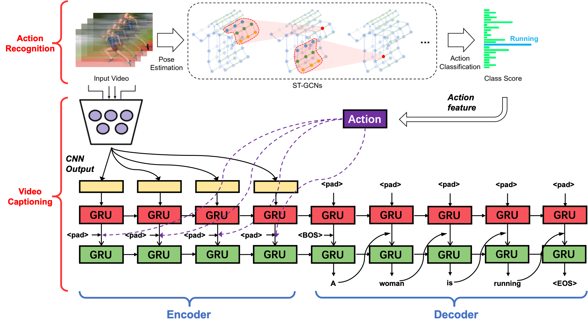
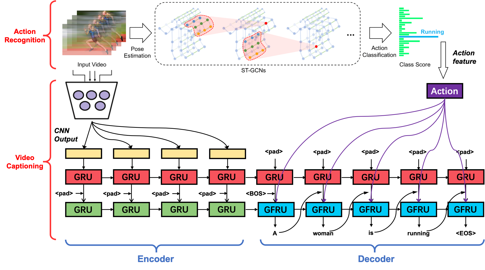

# S2VT_ACT
Final Project for UVa Vision and Language course [[Homepage]](https://www.vicenteordonez.com/vislang/)

Our project tries to enrich the sequence-to-sequence structure video captioning model with an action recognition model to emphasize the main action scene displayed in a video clip. For more details, please refer to our report. [[final report]](./reference/S2VT_ACT.pdf)

## Approach
### Current Forcing Fusion Model for S2VTACT

### Model Working in Progress
This model introduce the action feature into the decoder GRU by using a novel GRU unit called GFRU (first introduced in this paper: Lei Li, Yongfeng Zhang, Li Chen. Generate Neural Template Explanations for Recommendation. CIKM'20. [[Paper]](https://dl.acm.org/doi/10.1145/3340531.3411992))

## Dataset
### MSR-VTT
For video captioning, we use the MSR-VTT dataset. Since the VTT Challenge has ended, all the data (including test set) can be found online. I download and proceed it in here: https://drive.google.com/drive/folders/1l-P5NVzGQtYWHCsbcqHrzfcxnmaVecoT?usp=sharing  (NOTE: the link is restricted to people with UVa email)

## Reference
### Several reference github repo links
We reference some model structure and data processing settings provided by the following github repo:
1. For video captioning (S2VT): https://github.com/xiadingZ/video-caption.pytorch
2. For action recognition (ST-GCN): https://github.com/open-mmlab/mmskeleton
3. Model Fusion (GFRU): https://github.com/lileipisces/NETE

### Papers
1. Venugopalan, Subhashini, et al. "Sequence to sequence-video to text." Proceedings of the IEEE international conference on computer vision. 2015. [[Paper]](https://arxiv.org/abs/1505.00487)
2. Yan, Sijie, Yuanjun Xiong, and Dahua Lin. "Spatial temporal graph convolutional networks for skeleton-based action recognition." arXiv preprint arXiv:1801.07455 (2018). [[Paper]](https://arxiv.org/pdf/1801.07455.pdf)

### Useful links
1. awesome video captioning: https://github.com/tgc1997/Awesome-Video-Captioning